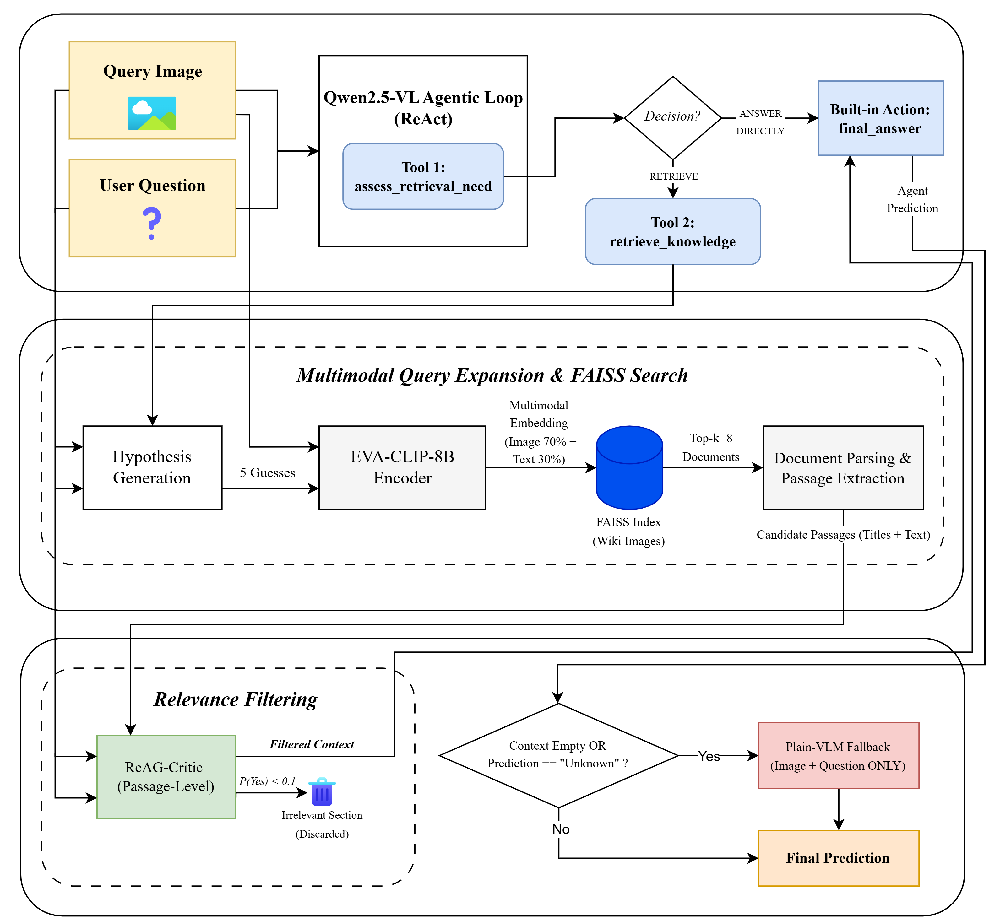

# Multimodal Agentic RAG for Knowledge-Based Visual Question Answering

<p align="center">
  
  
  
  
</p>

This repository implements an autonomous, multimodal Retrieval-Augmented Generation (RAG) pipeline designed to tackle Knowledge-Based Visual Question Answering (KB-VQA). By combining the vision-language reasoning capabilities of **Qwen2.5-VL** with a **ReAct-style agentic loop**, the system autonomously decides whether to answer visual queries directly or retrieve external knowledge from a large-scale, image-only Wikipedia FAISS index.

This project was developed for the *Computer Vision and Cognitive Systems* course at the University of Modena and Reggio Emilia (UNIMORE).

## 🚀 Key Architectural Choices

- **Entity Guessing (Visual HyDE):** Addresses the semantic gap in multimodal retrieval. Before querying the vector store, the Vision-Language Model (VLM) generates zero-shot taxonomic hypotheses about the visual subject. Fusing these text guesses with the image features drastically improves retrieval hit rates.
- **Strict Separation of Concerns:** To prevent false positives, the vector store (FAISS) processes *only* the entity guesses (no raw questions), while the relevance filter (ReAG-Critic) evaluates *only* the raw question against the retrieved text, remaining blind to potentially hallucinated guesses.
- **Section-Level Critic Filtering:** Overcomes the classic "context truncation vs. noise" trade-off. The system retrieves *full documents* and employs a high-resolution **ReAG-Critic** model to filter out irrelevant paragraphs individually, feeding the agent a highly condensed context.
- **Graceful Degradation:** A code-level fallback mechanism intercepts situations where the Critic filters out all retrieved evidence, forcing the agent to rely on its parametric visual reasoning rather than hallucinating over empty contexts.

---

## 🏗️ System Architecture

Our optimized pipeline operates in an autonomous ReAct loop, strictly limiting the action space to avoid cognitive overload on compact backbones (e.g., 3B parameters). 

<p align="center">
  
</p>

1. **`assess_retrieval_need`**: The agent visually inspects the image and determines if external knowledge is required.
2. **`retrieve_knowledge`**: Executes the Visual HyDE fusion, fetches the top-$k$ full documents from FAISS, and passes them to the ReAG-Critic for fine-grained section filtering.
3. **`final_answer`**: The agent synthesizes the final response conditioned strictly on the filtered, high-relevance paragraphs.

---

## 📊 Experimental Results (Encyclopedic-VQA)

The system was evaluated on a 1000-sample test subset of the **Encyclopedic-VQA** dataset. Evaluation relies on Exact Match and a BERT-based Answer Equivalence Model (BEM).

We track three decoupled metrics to isolate retrieval accuracy from generation reasoning:
- **Hit Rate:** Percentage of episodes where the oracle document is successfully retrieved.
- **Score | Hit:** Answering accuracy when the correct document is provided.
- **Score | Miss:** Answering accuracy when retrieval fails (reliance on pure visual reasoning).

| Configuration | Aggregate Score | Hit Rate | Score \| Hit | Score \| Miss |
| :--- | :---: | :---: | :---: | :---: |
| Plain VLM Baseline (3B) | 17.6% | - | - | - |
| Static RAG (Best Config) | 24.6% | 23.4% | 60.7% | 13.6% |
| **Agentic RAG (3B Backbone)** | **30.3%** | **28.3%** | **60.8%** | **18.3%** |
| Agentic RAG (7B Backbone) | 29.8% | **31.9%** | 57.7% | 16.7% |

*Note on Backbone Scaling: While the Qwen2.5-VL-7B model exhibits superior raw parametric knowledge and pushes the retrieval Hit Rate to a massive 31.9% (via better Visual HyDE hypotheses), its overconfidence leads it to bypass safety fallbacks and answer with a verbose format, slightly degrading the final score. This exposes a crucial alignment trade-off in Agentic RAG pipelines.*

---

## 🛠️ Usage

To run the full Agentic pipeline with the optimal configuration ($\alpha=0.3$, $k=8$):

```bash
python run_inference_agent.py \
    --model_id "Qwen/Qwen2.5-VL-3B-Instruct" \
    --top_k 8 \
    --text_weight 0.3 \
    --output_dir "/path/to/output"
```

## 👥 Authors
Nicolò Morini, Daria Vulcano

## 📚 Acknowledgments
This work builds upon the infrastructures and concepts provided by the AImageLab group at UNIMORE, including **Wiki-LLaVA** and **ReAG-Critic**.
